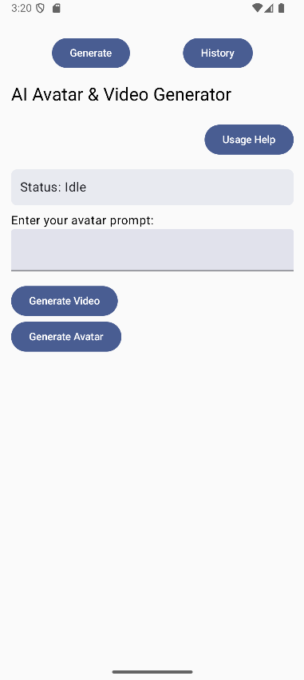
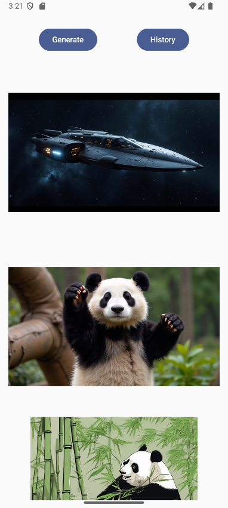

# AI Avatar Generator

An Android app powered by Hugging Face and Replicate APIs that allows users to:

- ✨ Generate fantasy-style avatars from text prompts
- 🎥 Generate short videos from prompts using advanced video diffusion models
- 💾 Save and view image/video history directly in your device's Pictures and Movies folders

---

## 🚀 Features

- **Text to Image (Avatar)**  
  Enter a creative prompt and generate a stylized fantasy avatar.

- **Text to Video**  
  Generate 5–8 second videos based on your prompt using the PixVerse model on Replicate.

- **Save & History**
    - Avatars saved in `Pictures/`
    - Videos saved in `Movies/`
    - View all saved media in the in-app *History* tab

---

## 📱 Screenshots

> 
> 

---

## 🛠️ Tech Stack

- **Frontend**: Kotlin, Jetpack Compose
- **Backend**: Python (Flask), Hugging Face Diffusers, Replicate API
- **APIs Used**:
    - `stabilityai/stable-diffusion-v1-4` (image)
    - `pixverse/pixverse-v4` (video)

---

## 📦 Dependencies

- Jetpack Compose
- Retrofit
- Coil
- Material 3
- AndroidView (for VideoView support)

---

## 🔐 Setup

### Backend

> Deploy Flask backend (in Jupyter or server) with ngrok or cloud:

```bash
pip install flask diffusers torch
python app.py
